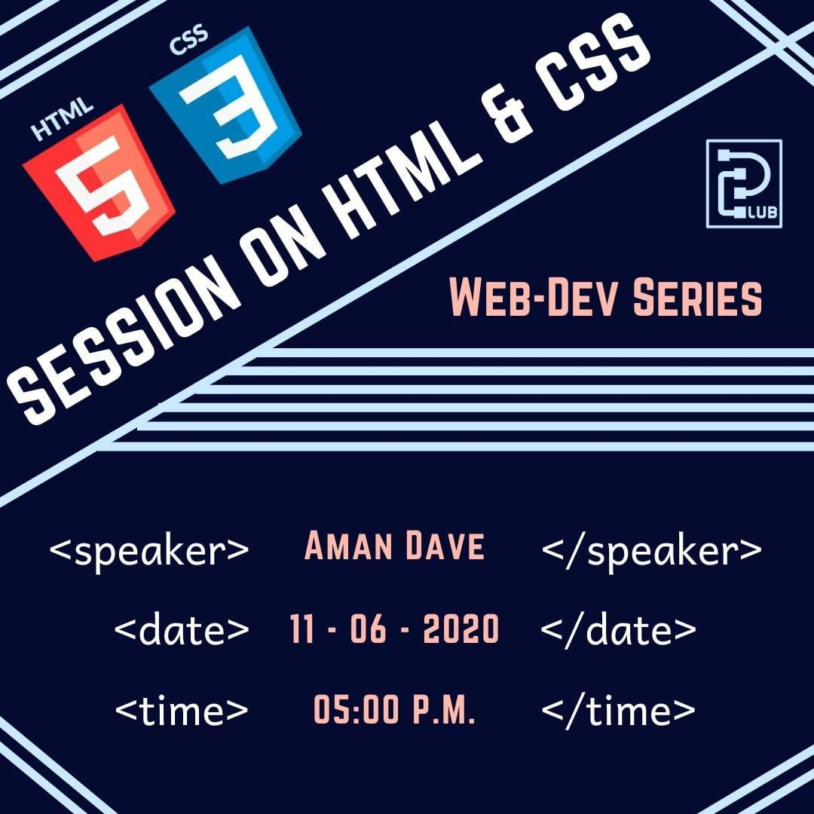
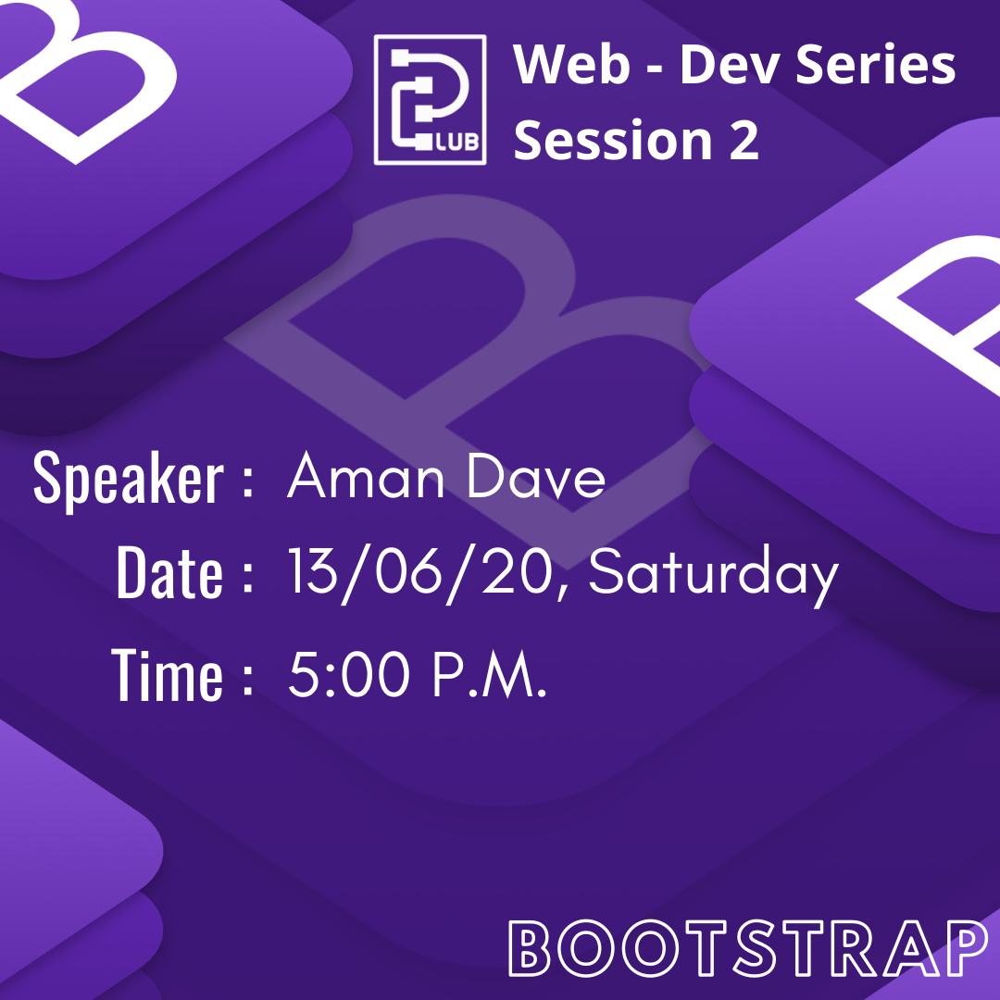
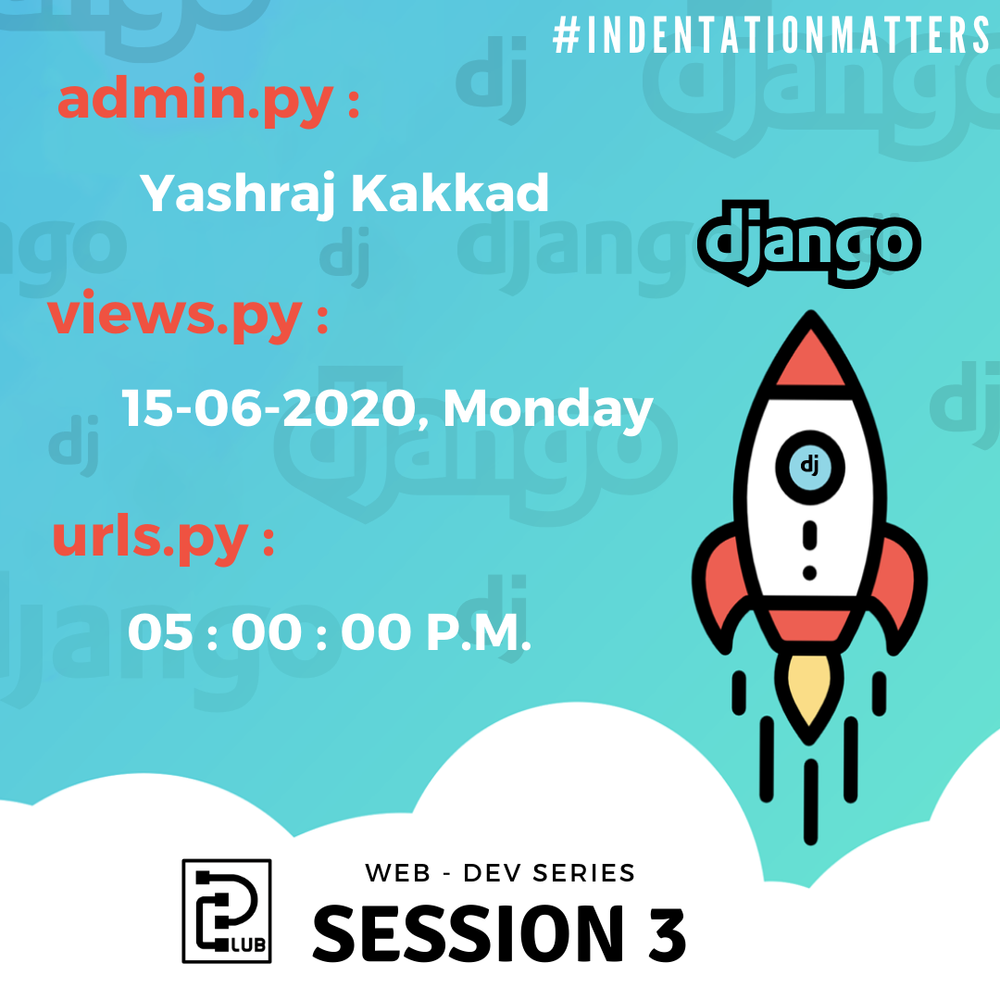
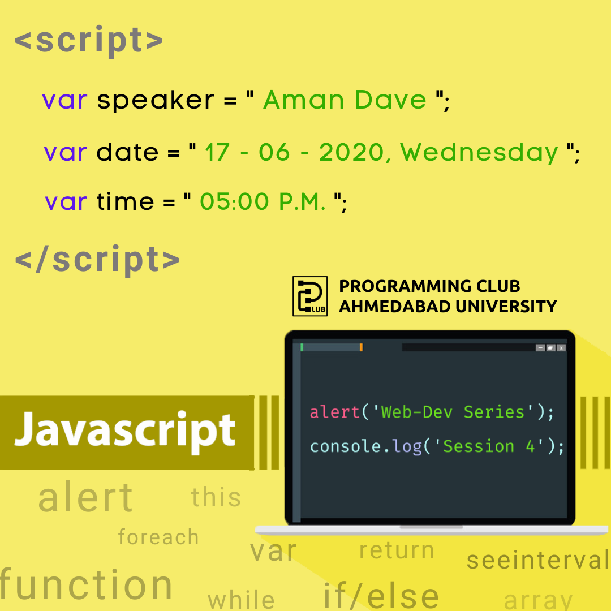
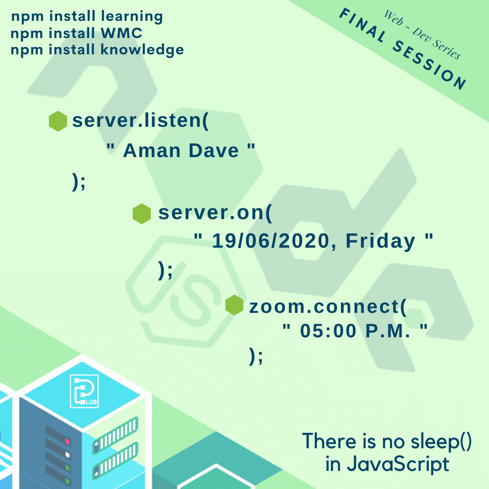

# Web Development Series

## Programming Club, Ahmedabad University

This repository maintains codes, diagrams, handouts and resources discussed during the Web Developement Series at Ahmedabad University

---

All the session were conducted between 11th June 2020 and 19th June 2020. Due to Covid pandemic, the sessions were taken online through the Zoom platform.

---

### Table of Content

-   [List of resources](https://docs.google.com/document/d/1oh9mcICHR0FlPMvGnXhc2KWCQfJlVstI5Yn3VRyL4QM/edit?usp=sharing)

1. HTML/CSS

    

    - Speaker: [Aman Dave](https://github.com/aman-dave)
    - [Codes](https://github.com/aman-dave/Web-Development-Series/tree/master/Session_1_HTML_CSS/Codes/Aman%20Dave)
    - [Diagram Explanation](https://github.com/aman-dave/Web-Development-Series/tree/master/Session_1_HTML_CSS/Session%20Data)

2. BootStrap

    

    - Speaker: [Aman Dave](https://github.com/aman-dave)
    - [Codes](https://github.com/aman-dave/Web-Development-Series/tree/master/Session_2_Bootstrap/Codes/Aman%20Dave)
    - [Diagram Explanation](https://github.com/aman-dave/Web-Development-Series/tree/master/Session_2_Bootstrap/Session%20Data)

3. Django

    

    - Speaker: [Yashraj Kakkad](https://github.com/yashrajkakkad)
    - [Codes](https://github.com/aman-dave/Web-Development-Series/tree/master/Session_3_Django/Codes/Yashraj%20Kakkad)
    - [PDF Handout](https://github.com/aman-dave/Web-Development-Series/blob/master/Session_3_Django/Django_Handout.pdf)

4) JavaScript

     

    - Speaker: [Aman Dave](https://github.com/aman-dave)
    - [Codes](https://github.com/aman-dave/Web-Development-Series/tree/master/Session_4_JavaScript/Codes/Aman%20Dave)
    - [Diagram Explanation](https://github.com/aman-dave/Web-Development-Series/tree/master/Session_4_JavaScript/Session%20Data)

5) Node.js

     

    - Speaker: [Aman Dave](https://github.com/aman-dave)
    - [Codes](https://github.com/aman-dave/Web-Development-Series/tree/master/Session_5_Node_js/Codes/Aman%20Dave)
    - [Diagram Explanation](https://github.com/aman-dave/Web-Development-Series/tree/master/Session_5_Node_js/Session%20Data)
